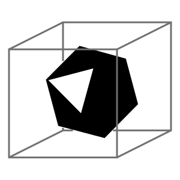

# docker-crystal



Simple shell script for running crystal builds / specs / doc generation inside the official crystal-lang docker images.

## Installation

Obtain a copy of docker-crystal.sh (clone this repo or [download](https://raw.githubusercontent.com/aca-labs/docker-crystal/master/docker-crystal.sh)).

Ensure it's executable.
```bash
chmod +x ./docker-crystal.sh
```

Add it to you PATH
```bash
ln -s $(pwd)/docker-crystal.sh ~/bin/docker-crystal
```

## Usage

From your project root, use `docker-crystal` in the exact same way you've previously used the `crystal` command.

```bash
docker-crystal spec
```

```bash
docker-crystal build
```

Instead of using (or even requiring) the locally installed version, it will spin up an ephemeral container based on the crystal version in your projects `shard.yml`. Any build artifacts or docs generated will appear in the local file system as though they had been built natively.
